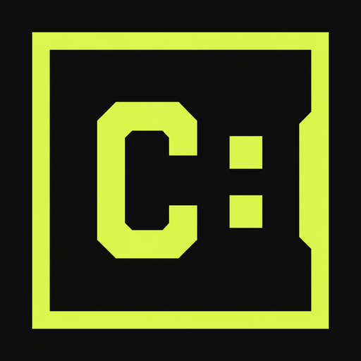

<p align="center">
  
</p>

<h1 align="center">canon</h1>

<p align="center"><strong>Persistent records for agent-led software.</strong></p>

`canon` is a CLI for managing the canonical records of a codebase —
Architecture Decision Records (ADRs), software specifications (SPECs), and the
Domain Model (one canonical concept per domain entry) — in agent-led
workflows.

The initial command surface is intentionally agent-centric:

- JSON output by default, with a versioned envelope.
- `canon commands` for machine-readable discovery of commands, side effects, selectors, and examples.
- `--dry-run` on every mutating command.
- Structured errors with codes, categories, and suggested fixes.
- Stable ADR ids like `ADR-0001` for command composition.
- `canon skill` plus `canon skill install/update` to publish a repository-local
  bundle of agent skills, supporting files, and target-specific subagents.

## Website

The project landing page lives in [`site/`](site/) as dependency-free static
HTML, CSS, and JavaScript. A GitHub Actions workflow publishes that directory
to GitHub Pages after Pages is configured to use GitHub Actions as its source.

Preview it locally with any static file server, for example:

```sh
python3 -m http.server 8080 --directory site
```

## Build

```sh
go build ./cmd/canon
```

## Install

Install the latest version directly with Go:

```sh
go install github.com/victorhsb/canon/cmd/canon@latest
```

Alternatively, use the repository's install script to build and place the
binary on your PATH:

```sh
scripts/install.sh              # installs to ~/.local/bin or /usr/local/bin
scripts/install.sh --dry-run      # preview the install plan
scripts/install.sh --prefix /opt  # install to /opt/bin
```

To remove the binary later:

```sh
scripts/install.sh --uninstall
```

## Quick start

```sh
canon commands
canon doctor
canon adr init --dry-run
canon adr init
canon adr new --title "Use CANON for decisions" --status proposed --dry-run
canon adr new --title "Use CANON for decisions" --status proposed
canon list
canon show --id ADR-0001
canon skill install --dry-run
canon skill install
```

ADRs are stored as markdown files in `docs/adr` by default. Use `--adr-dir` before
the command to select another directory:

```sh
canon --adr-dir architecture/decisions list
```

## Documentation

- [Command reference](docs/commands.md)
- [ADR file format](docs/adr-format.md)
- [SPEC file format](docs/spec-format.md)
- [Domain entry file format](docs/domain-format.md)
- [Agent workflow guide](docs/agent-workflows.md)
- [Project roadmap](docs/roadmap.md)

## Design principles

`canon` is designed for agents first:

- Discovery is structured through `canon commands`.
- Mutations are previewable with `--dry-run`.
- Output is parseable JSON unless `--format text` is explicitly requested.
- Failures include machine-readable error codes and suggested fixes.
- Command outputs include stable ids and next actions for workflow composition.
- The bundled agent skills can be installed below `.agents/skills` together with
  target-specific subagent renderings, then updated through previewable CLI
  commands.
